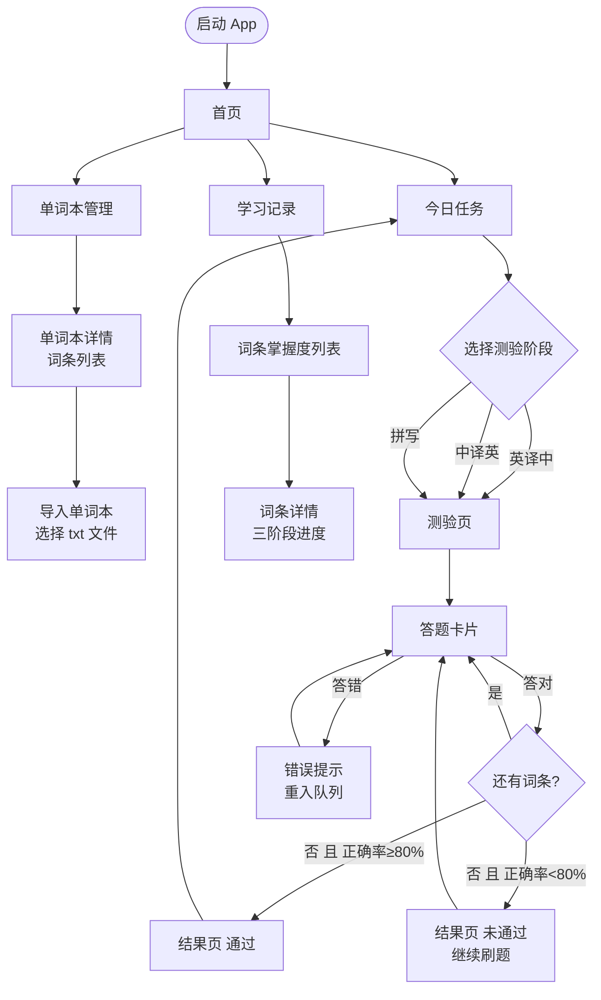

# UX 交互设计文档

## 设计原则

- **适合儿童**：卡片式 + 扁平风格，主色调绿色，参考 Duolingo 风格
- **操作极简**：每个页面只做一件事，减少认知负担
- **即时反馈**：答题后立即给出对错提示，不让孩子等待
- **鼓励为主**：过关时有庆祝动效，答错时温和提示

---

## 一、页面流程图



---

## 二、页面信息架构

### 1. 首页 `/`

**用途**：导航入口 + 今日学习概况

```
┌─────────────────────────────┐
│  🌟 Word Master              │  ← App 名称 + logo
│                             │
│  今日进度                    │  ← 当前学生名
│  ████░░░░  3/5 个单词本已完成 │  ← 总体进度条
│                             │
│  ┌──────────┐ ┌──────────┐  │
│  │  今日任务  │ │  单词本   │  │  ← 两个主要入口
│  └──────────┘ └──────────┘  │
│                             │
│  ┌──────────────────────┐   │
│  │     学习记录          │   │  ← 次要入口
│  └──────────────────────┘   │
└─────────────────────────────┘
```

**数据来源**：`quiz_sessions`（今日已完成数）、`wordbooks`（总数）

---

### 2. 单词本管理 `/wordbooks`

**用途**：查看和导入单词本

```
┌─────────────────────────────┐
│  ← 单词本                  + │  ← 返回 + 导入按钮
├─────────────────────────────┤
│  ┌───────────────────────┐  │
│  │ 第二周高频短语         │  │
│  │ 50 个词条  已掌握 12   │  │  ← 词条总数 + 掌握数
│  └───────────────────────┘  │
│  ┌───────────────────────┐  │
│  │ 第一周单词             │  │
│  │ 30 个词条  已掌握 30 ✓ │  │  ← 全部掌握显示 ✓
│  └───────────────────────┘  │
└─────────────────────────────┘
```

点击单词本卡片 → **单词本详情页**

#### 2a. 单词本详情 `/wordbooks/:id`

```
┌─────────────────────────────┐
│  ← 第二周高频短语            │
├─────────────────────────────┤
│  50 个词条                   │
│  ─────────────────────────  │
│  be good at      擅长于  ●   │  ← ● 绿色=已掌握 ○ 灰色=未掌握
│  look forward to 期待    ○   │
│  in order to     为了    ○   │
│  ...                        │
└─────────────────────────────┘
```

**数据来源**：`wordbook_items JOIN items LEFT JOIN student_mastery`

---

### 3. 今日任务 `/tasks`

**用途**：选择单词本和测验阶段，开始测验

```
┌─────────────────────────────┐
│  ← 今日任务                  │
├─────────────────────────────┤
│  选择单词本：                 │
│  ┌───────────────────────┐  │
│  │ ✓ 第二周高频短语        │  │  ← 下拉或列表选择
│  └───────────────────────┘  │
│                             │
│  选择测验阶段：               │
│  ┌────────┐ ┌────────┐      │
│  │ 英译中  │ │ 中译英  │      │  ← 所有词条均支持
│  └────────┘ └────────┘      │
│  ┌────────┐                 │
│  │  拼 写  │  ← 仅当单词本    │  ← 含单词时才可选
│  └────────┘    含单词时可选   │     纯短语单词本置灰
│                             │
│  [ 开始测验 50 个词条 ]       │  ← 主操作按钮
└─────────────────────────────┘
```

**阶段说明**（悬停/长按显示）：
- 英译中：看英文说出中文含义（单词 + 短语均支持）
- 中译英：看中文说出英文读音（单词 + 短语均支持）
- 拼写：看中文用键盘拼写英文（**仅单词**，短语跳过此阶段）

---

### 4. 测验页 `/quiz/:sessionId`

**用途**：核心答题页面，一次显示一个词条

#### 4a. 答题卡片状态机

```
                ┌─────────┐
                │  待答题  │  显示题目 + 麦克风/键盘按钮
                └────┬────┘
                     │ 按下录音/开始输入
                     ▼
                ┌─────────┐
                │  回答中  │  录音波形动效 / 键盘输入中
                └────┬────┘
                     │ 松开/提交
                     ▼
                ┌─────────┐
                │  判断中  │  转圈 loading（调用 AI 语义识别）
                └────┬────┘
           ┌─────────┴─────────┐
           ▼                   ▼
      ┌─────────┐         ┌─────────┐
      │  答对了  │         │  答错了  │
      │  ✅ 绿色 │         │  ❌ 红色 │
      │ 显示正确答案│        │ 显示正确答案│
      └────┬────┘         └────┬────┘
           │ 1.5s 后自动        │ 2s 后自动
           ▼                   ▼
      ┌─────────┐         ┌─────────┐
      │ 下一词条 │         │ 重入队列 │
      └─────────┘         └─────────┘
```

#### 4b. 答题卡片布局

**英译中阶段**（看英文，语音说中文）：
```
┌─────────────────────────────┐
│  第 8 / 50 题    正确率 87%  │  ← 进度 + 实时正确率
│  ░░░░░░░░░░░░░░░░           │  ← 进度条
├─────────────────────────────┤
│                             │
│       be good at            │  ← 大字显示英文
│                             │
│    [ 🔊 播放发音 ]           │  ← 可点击朗读
│                             │
│  ┌───────────────────────┐  │
│  │  🎤 按住说出中文含义    │  │  ← 语音输入按钮
│  └───────────────────────┘  │
└─────────────────────────────┘
```

**中译英阶段**（看中文，语音说英文）：
```
├─────────────────────────────┤
│                             │
│          擅长于              │  ← 大字显示中文
│                             │
│  ┌───────────────────────┐  │
│  │  🎤 按住说出英文读音    │  │
│  └───────────────────────┘  │
└─────────────────────────────┘
```

**拼写阶段**（看中文，键盘输入英文）：
```
├─────────────────────────────┤
│                             │
│          擅长于              │  ← 大字显示中文
│                             │
│  ┌───────────────────────┐  │
│  │  _________________    │  │  ← 键盘文本输入框
│  └───────────────────────┘  │
│       [ 提 交 ]              │
└─────────────────────────────┘
```

**答对反馈**：
```
├─────────────────────────────┤
│  ✅ 正确！                   │  ← 绿色背景
│                             │
│       be good at            │
│       擅长于 ✓               │
│                             │
│  例句：She is good at math.  │  ← 显示例句
│        她擅长数学。           │
└─────────────────────────────┘
```

**答错反馈**：
```
├─────────────────────────────┤
│  ❌ 再想想～                  │  ← 红色背景，温和语气
│                             │
│  你的回答：be goof at        │
│  正确答案：be good at        │  ← 对比显示
│                             │
│  [ 🔊 听正确读音 ]           │
└─────────────────────────────┘
```

---

### 5. 结果页 `/quiz/:sessionId/result`

**通过**：
```
┌─────────────────────────────┐
│        🎉 太棒了！            │  ← 撒花动效
│                             │
│      正确率  92%             │  ← 大字显示
│      用时    4分23秒         │
│      答对    46 / 50         │
│                             │
│  连续答错最多的词条：          │  ← 薄弱项提示
│  - look forward to (3次)    │
│                             │
│  [ 继续下一阶段 ]             │  ← 主按钮
│  [ 返回今日任务 ]             │  ← 次按钮
└─────────────────────────────┘
```

**未通过**：
```
┌─────────────────────────────┐
│        💪 继续加油！          │
│                             │
│      正确率  65%             │
│      还差    15%             │
│                             │
│  还需巩固的词条：             │
│  - in order to              │
│  - regardless of            │
│                             │
│  [ 重新测验薄弱词条 ]         │  ← 只测验答错的词条
│  [ 重新测验全部 ]             │
└─────────────────────────────┘
```

---

### 6. 学习记录 `/records`

**用途**：查看各词条掌握情况

```
┌─────────────────────────────┐
│  ← 学习记录                  │
├─────────────────────────────┤
│  筛选：[全部] [已掌握] [待加强]│
├─────────────────────────────┤
│  be good at    【短语】       │
│  擅长于                      │
│  英译中 ████████░░ 80        │  ← 短语只显示两个维度
│  中译英 ██████░░░░ 60        │
│  ─────────────────────────  │
│  hello         【单词】       │
│  你好                        │
│  英译中 ██████████ 100 ✓    │
│  中译英 ████████░░ 80 ✓     │
│  拼  写 ███░░░░░░░ 30        │  ← 单词才显示拼写维度
└─────────────────────────────┘
```

**数据来源**：`student_mastery JOIN items`

> 注意：`type = 'phrase'` 的词条不显示「拼写」维度，`student_mastery.spelling_level` 对短语始终为 null，不参与掌握度计算。

---

## 三、路由结构

```
/                       首页
/wordbooks              单词本列表
/wordbooks/:id          单词本详情
/tasks                  今日任务（选单词本+阶段）
/quiz/:sessionId        测验答题
/quiz/:sessionId/result 测验结果
/records                学习记录
```

---

## 四、组件拆分（供脚手架参考）

```
src/
├── pages/
│   ├── HomePage.tsx
│   ├── WordbooksPage.tsx
│   ├── WordbookDetailPage.tsx
│   ├── TasksPage.tsx
│   ├── QuizPage.tsx
│   ├── QuizResultPage.tsx
│   └── RecordsPage.tsx
├── components/
│   ├── QuizCard/
│   │   ├── QuizCard.tsx          ← 答题卡片主组件
│   │   ├── VoiceInput.tsx        ← 语音输入按钮
│   │   ├── SpellingInput.tsx     ← 拼写键盘输入
│   │   ├── AnswerFeedback.tsx    ← 答对/答错反馈
│   │   └── ProgressBar.tsx       ← 顶部进度条
│   ├── WordbookCard.tsx          ← 单词本卡片
│   ├── ItemRow.tsx               ← 词条行
│   ├── MasteryBar.tsx            ← 掌握度进度条
│   └── TtsButton.tsx             ← 朗读按钮
└── layouts/
    └── AppLayout.tsx             ← 底部导航栏
```
